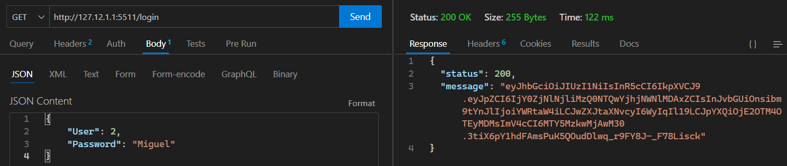
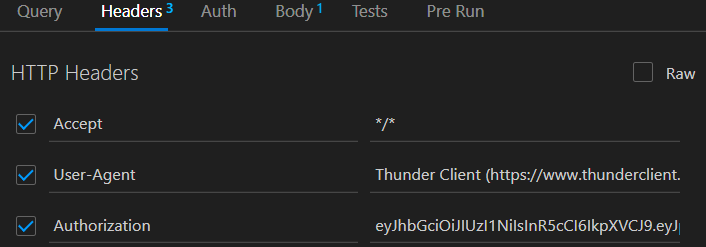

# Farmacia Campus
## Objetivo
Como cliente de una farmacia, requiero un sistema de gestión que me permita gestionar las ventas y compras, interactuar con proveedores, empleados y pacientes,  generar informes de ventas y caducidad de medicamentos. Es esencial que este software pase por un proceso de análisis de requerimientos, diseño, implementación, pruebas, y eventual retiro, garantizando en todo momento la adaptabilidad, confiabilidad y eficiencia para las operaciones diarias de la farmacia.

# Instalación

1. Clonar este repositorio
2. En la terminal del proyecto ejecute el comando `npm i`
3. Cambie el nombre del archivo `.env.example` a `.env`
4. Ejecutar el comando `npm run dev` el cual iniciará el servidor

# Api
## **uri:** `http://127.12.1.1:5511`
# Generar Token
En este proyecto para generar el token usumos un usuario de la base de datos en este caso utilizaremos estos datos para acceder a todos los endpoints.
- Endpoint: `login`
- **Importante** en el body debe poner los siguientes datos:
```json
{
    "User": 1,
    "Password": "Dr. Martinez"
}
```
Si todo sale correcto nos deberia generar el token de esta forma



# Validar token
Para poder ingresar a cada endpoint de esta Api debe ingresar el token generado anteriormente en los **Headers** de nuestra consulta de esta forma



# Consultas
1. `/medicamentos/menor50` Obtener todos los medicamentos con menos de 50 unidades en stock
    <details>
    <summary>Datos de salida</summary>

    ```json
    [
        {
            "_id": "64f7435065eee1a67b274bc9",
            "med_id": 2,
            "med_nombre": "Simvastatina",
            "contacto_proveedor": "Angie",
            "precio": 10000,
            "stock": 40,
            "caducidad": "2024-03-20"
        },
        {
            "_id": "64f7435065eee1a67b274bcb",
            "med_id": 4,
            "med_nombre": "Omeprazol",
            "contacto_proveedor": "Fernando",
            "precio": 50000,
            "stock": 20,
            "caducidad": "2022-07-30"
        }
    ]
    ```
    </details>

2. `/proveedor/contacto` Listar los proveedores con su información de contacto en medicamentos
    <details>
    <summary>Datos de salida</summary>

    ```json
    [
        {
            "prov_id": 1,
            "prov_nombre": "Santiago",
            "Info": [
                {
                    "med_nombre": "Paracetamol",
                    "contacto_proveedor": "Santiago"
                },
                {
                    "med_nombre": "Aspirina",
                    "contacto_proveedor": "Santiago"
                }
            ]
        },
        {
            "prov_id": 2,
            "prov_nombre": "Angie",
            "Info": [
                {
                    "med_nombre": "Simvastatina",
                    "contacto_proveedor": "Angie"
                }
            ]
        },
        {
            "prov_id": 3,
            "prov_nombre": "Fernando",
            "Info": [
                {
                    "med_nombre": "Omeprazol",
                    "contacto_proveedor": "Fernando"
                }
            ]
        }
    ]
    ```
    </details>

3. `/medicamentos/comprados` Medicamentos comprados a 'Santiago'
    <details>
    <summary>Datos de salida</summary>

    ```json
    [
        {
            "_id": "64f7435065eee1a67b274bc8",
            "med_id": 1,
            "med_nombre": "Paracetamol",
            "contacto_proveedor": "Santiago",
            "precio": 2000,
            "stock": 200,
            "caducidad": "2023-10-11"
        },
        {
            "_id": "64f7435065eee1a67b274bca",
            "med_id": 3,
            "med_nombre": "Aspirina",
            "contacto_proveedor": "Santiago",
            "precio": 1000,
            "stock": 300,
            "caducidad": "2023-02-08"
        }
    ]
    ```
    </details>

4. `/receta/enero` Obtener recetas médicas emitidas después del 1 de enero de 2023
    <details>
    <summary>Datos de salida</summary>

    ```json
    [
        {
            "_id": "64f7435065eee1a67b274bc6",
            "rec_id": 1,
            "id_paciente": 1,
            "id_medicamento": 1,
            "nombre_empleado": "Dr. Martinez",
            "cantidad": 2,
            "rec_fecha": "23-09-2023"
        }
    ]
    ```
    </details>

5. `/venta/medicamento` Total de ventas del medicamento 'Paracetamol'
    <details>
    <summary>Datos de salida</summary>

    ```json
    {
        "Cantidad": 2
    }
    ```
    </details>

6. `/medicamentos/caduca` Medicamentos que caducan antes del 1 de enero de 2024
    <details>
    <summary>Datos de salida</summary>

    ```json
    [
        {
            "_id": "64f7435065eee1a67b274bc8",
            "med_id": 1,
            "med_nombre": "Paracetamol",
            "contacto_proveedor": "Santiago",
            "precio": 2000,
            "stock": 200,
            "caducidad": "2023-10-11"
        },
        {
            "_id": "64f7435065eee1a67b274bca",
            "med_id": 3,
            "med_nombre": "Aspirina",
            "contacto_proveedor": "Santiago",
            "precio": 1000,
            "stock": 300,
            "caducidad": "2023-02-08"
        },
        {
            "_id": "64f7435065eee1a67b274bcb",
            "med_id": 4,
            "med_nombre": "Omeprazol",
            "contacto_proveedor": "Fernando",
            "precio": 50000,
            "stock": 20,
            "caducidad": "2022-07-30"
        }
    ]
    ```
    </details>


7. `/proveedor/vendido` Total de medicamentos vendidos por cada proveedor
    <details>
    <summary>Datos de salida</summary>

    ```json
    [
        {
            "_id": 3,
            "prov_nombre": "Fernando",
            "Ventas": 5
        },
        {
            "_id": 1,
            "prov_nombre": "Santiago",
            "Ventas": 5
        },
        {
            "_id": 2,
            "prov_nombre": "Angie",
            "Ventas": 2
        }
    ]
    ```
    </details>


8. Cantidad total de dinero recaudado por las ventas de medicamentos
    <details>
    <summary>Datos de salida</summary>

    ```json
    {
        "Cantidad": 2
    }
    ```
    </details>

9. Recetas prescritas por el Dr. Martínez
    <details>
    <summary>Datos de salida</summary>

    ```json
    {
        "Cantidad": 2
    }
    ```
    </details>


10. Medicamentos que no han sido vendidos
    <details>
    <summary>Datos de salida</summary>

    ```json
    {
        "Cantidad": 2
    }
    ```
    </details>


11. Obtener el medicamento más caro

12. Número de medicamentos por proveedor

13. Pacientes que han comprado Paracetamol

14. Proveedores que no han vendido medicamentos en el último año

15. Obtener el total de medicamentos vendidos en marzo de 2023

16. Obtener el medicamento menos vendido en 2023

17. Ganancia total por proveedor en 2023 (asumiendo un campo precioCompra en Compras)

18. Promedio de medicamentos comprados por venta

19. Medicamentos que tienen menos de 50 unidades en stock

20. Cantidad de ventas realizadas por cada empleado en 2023

21. Obtener todos los medicamentos que expiren en 2024

22. Empleados que hayan hecho más de 5 ventas en total

23. Medicamentos que no han sido vendidos nunca

24. Paciente que ha gastado más dinero en 2023

25. Empleados que no han realizado ninguna venta en 2023

26. Proveedor que ha suministrado más medicamentos en 2023

27. Pacientes que compraron el medicamento "Paracetamol" en 2023

28. Total de medicamentos vendidos por mes en 2023

29. Empleados con menos de 5 ventas en 2023

30. Número total de proveedores que suministraron medicamentos en 2023

31. Proveedores de los medicamentos con menos de 50 unidades en stock

32. Pacientes que no han comprado ningún medicamento en 2023

33. Medicamentos que han sido vendidos cada mes del año 2023

34. Empleado que ha vendido la mayor cantidad de medicamentos distintos en 2023

35. Total gastado por cada paciente en 2023

36. Medicamentos que no han sido vendidos en 2023

37. Proveedores que han suministrado al menos 5 medicamentos diferentes en 2023

38. Total de medicamentos vendidos en el primer trimestre de 2023

39. Empleados que no realizaron ventas en abril de 2023

40. Medicamentos con un precio mayor a 50 y un stock menor a 100


# Get
## Endpoints
